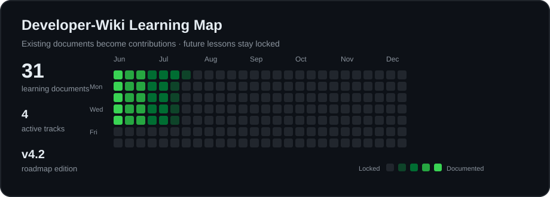

# 📚 Developer-Wiki

  <strong>수업을 다시 재생할 수 있는 개인 개발 교재</strong> 
  개념 → 이유 → 예제 → 문제 → 비교 → 복습까지 한 문서에서 이어집니다.

  

> [!NOTE]
> 이 맵은 출석률이나 실제 공부 시간을 의미하지 않습니다. 현재 Developer-Wiki에 존재하는 **31개 학습 문서**를 GitHub Contribution 형태로 시각화한 정적 학습 맵입니다. 새 수업 문서가 추가되면 잠금 칸이 활성 칸으로 바뀝니다.

## 🔥 Continue Learning

| 현재 단계 | 문서 | 상태 |
|---|---|---|
| Python 기초 | [Python List와 range](./Python/Basic/Python_List_Range.md) | 진행 중 |
| 다음 복습 | [JavaScript DOM](./Frontend/JavaScript/Basic/JS_DOM.md) | 7일 복습 권장 |
| 다음 과정 | 데이터 파이프라인·탐색 분석 | 🔒 문서 작성 전 |

## 🧭 Learning Table of Contents

아래 목차에서 **파란색 문서명은 실제 Markdown 파일로 연결**됩니다. 아직 수업하지 않았거나 Developer-Wiki 문서가 작성되지 않은 항목은 `🔒` 상태이며 링크가 없습니다.

### 🌐 Frontend

<strong>HTML</strong> · 5 documents · ✅ Documented

- [HTML 문서 구조](./Frontend/HTML/Basic/HTML_Document_Structure.md)
- [HTML 태그와 속성](./Frontend/HTML/Basic/HTML_Tag_Attribute.md)
- [HTML 목록과 표](./Frontend/HTML/Basic/HTML_List_Table.md)
- [HTML 링크·경로·이미지](./Frontend/HTML/Basic/HTML_Link_Path_Image.md)
- [HTML Form](./Frontend/HTML/Basic/HTML_Form.md)

<strong>CSS</strong> · 10 documents · ✅ Documented

- [CSS 선택자](./Frontend/CSS/Basic/CSS_Selector.md)
- [CSS Font](./Frontend/CSS/Basic/CSS_Font.md)
- [CSS Box Model](./Frontend/CSS/Basic/CSS_Box_Model.md)
- [CSS Display](./Frontend/CSS/Basic/CSS_Display.md)
- [CSS Position과 Overflow](./Frontend/CSS/Basic/CSS_Position_Overflow.md)
- [CSS Flexbox](./Frontend/CSS/Basic/CSS_Flexbox.md)
- [CSS Float와 Shadow](./Frontend/CSS/Basic/CSS_Float_Shadow.md)
- [CSS Background와 Opacity](./Frontend/CSS/Basic/CSS_Background_Opacity.md)
- [CSS Transition과 Transform](./Frontend/CSS/Basic/CSS_Transition_Transform.md)
- [CSS Media Query](./Frontend/CSS/Basic/CSS_Media_Query.md)

<strong>JavaScript</strong> · 11 documents · ✅ Documented

- [변수와 자료형](./Frontend/JavaScript/Basic/JS_Variable_Type.md)
- [연산자와 조건문](./Frontend/JavaScript/Basic/JS_Operator_Condition.md)
- [반복문](./Frontend/JavaScript/Basic/JS_Loop.md)
- [함수와 화살표 함수](./Frontend/JavaScript/Basic/JS_Function_Arrow.md)
- [문자열](./Frontend/JavaScript/Basic/JS_String.md)
- [배열](./Frontend/JavaScript/Basic/JS_Array.md)
- [날짜 객체](./Frontend/JavaScript/Basic/JS_Date.md)
- [DOM](./Frontend/JavaScript/Basic/JS_DOM.md)
- [이벤트와 Form](./Frontend/JavaScript/Basic/JS_Event_Form.md)
- [비동기·JSON·AJAX](./Frontend/JavaScript/Basic/JS_Async_JSON_AJAX.md)
- [외부 API](./Frontend/JavaScript/Basic/JS_External_API.md)

### 🐍 Python

<strong>Python Basic</strong> · 5 documents · 🔥 Learning

- [Hello Python](./Python/Basic/Python_Hello.md)
- [변수와 연산자](./Python/Basic/Python_Variable_Operator.md)
- [문자열](./Python/Basic/Python_String.md)
- [List와 range](./Python/Basic/Python_List_Range.md)
- [Tuple](./Python/Basic/Python_Tuple.md)

## 🔒 Upcoming Curriculum

아래 항목은 업로드한 26주 시간표의 교육 흐름을 참고해 배치했습니다. 아직 Developer-Wiki에 대응하는 Markdown 문서가 없으므로 링크를 걸지 않았습니다.

<strong>Data & Storage</strong> · 예정

- 🔒 Python 데이터 파이프라인·탐색 분석
- 🔒 RDB 설계
- 🔒 문서 데이터베이스
- 🔒 Vector Database

<strong>AI Service Backend</strong> · 예정

- 🔒 FastAPI
- 🔒 Django
- 🔒 AI 서비스 API 레이어
- 🔒 인증·예외·배포 기초

<strong>RAG & AI Agent</strong> · 예정

- 🔒 Embedding과 검색
- 🔒 RAG Architecture
- 🔒 RAG Project
- 🔒 Tool Calling
- 🔒 AI Agent
- 🔒 Agent Project

<strong>Quality & Final Project</strong> · 예정

- 🔒 책임 있는 AI·보안 컴플라이언스
- 🔒 품질보증·배포·운영관리
- 🔒 개인화 추천·매칭 엔진
- 🔒 최종 프로젝트와 포트폴리오

> [!IMPORTANT]
> 예정 항목은 수업을 진행하고 관련 문서를 실제로 작성한 뒤에만 링크로 전환합니다. 빈 파일이나 임시 링크를 만들어 진행된 것처럼 표시하지 않습니다.

## 📊 Progress by Track

| Track | Documents | Progress |
|---|---:|---|
| HTML | 5 | `██████████` Documented |
| CSS | 10 | `██████████` Documented |
| JavaScript | 11 | `██████████` Documented |
| Python Basic | 5 | `██████░░░░` Learning |
| Data & Storage | 0 | `░░░░░░░░░░` Locked |
| Backend | 0 | `░░░░░░░░░░` Locked |
| RAG & Agent | 0 | `░░░░░░░░░░` Locked |

## 🧩 How the Roadmap Works

1. 수업을 진행한다.
2. 해당 내용을 기존 문서에 통합하거나 새 Markdown 문서로 작성한다.
3. 문서가 자체 검수를 통과하면 이 목차의 잠금을 해제한다.
4. 목차 항목에 실제 상대 링크를 연결한다.
5. `learning-map.svg`의 잠금 칸을 활성 칸으로 갱신한다.

이 방식에서는 **문서의 존재 여부가 진행 상태의 기준**입니다. PDF 시간표는 전체 교육 순서를 알려주는 참고 자료이고, 메인 화면의 활성화 여부는 Developer-Wiki의 실제 파일을 기준으로 결정합니다.

## 📖 Documentation Guide

| 표시 | 의미 |
|---|---|
| ✅ Documented | 문서가 작성되어 링크로 이동할 수 있음 |
| 🔥 Learning | 현재 학습하거나 복습 중인 문서 |
| 🔒 Locked | 아직 문서가 없어 이동할 수 없음 |
| 💡 WHY | 개념이 필요한 이유 |
| ⚠️ Common Mistake | 자주 발생하는 실수 |
| ✅ Check Point | 다음 학습 전 이해도 확인 |

## 🛠 Project Manual

- 수업 범위를 벗어난 주제를 문서 수를 늘리기 위해 추가하지 않습니다.
- 문제는 별도 `Problems` 폴더로 분리하지 않고 관련 개념 문서에 통합합니다.
- 각 문서는 개념, 이유, 예제, 수업 문제, 풀이 비교, Check Point, 면접 질문, 복습 기록을 포함합니다.
- 검수 결과는 [AUDIT_REPORT.md](./AUDIT_REPORT.md)에서 확인할 수 있습니다.
- 변경 내역은 [CHANGELOG.md](./CHANGELOG.md), 버전은 [VERSION.md](./VERSION.md)에서 관리합니다.

---

  <strong>Read → Code → Compare → Review → Repeat</strong>

